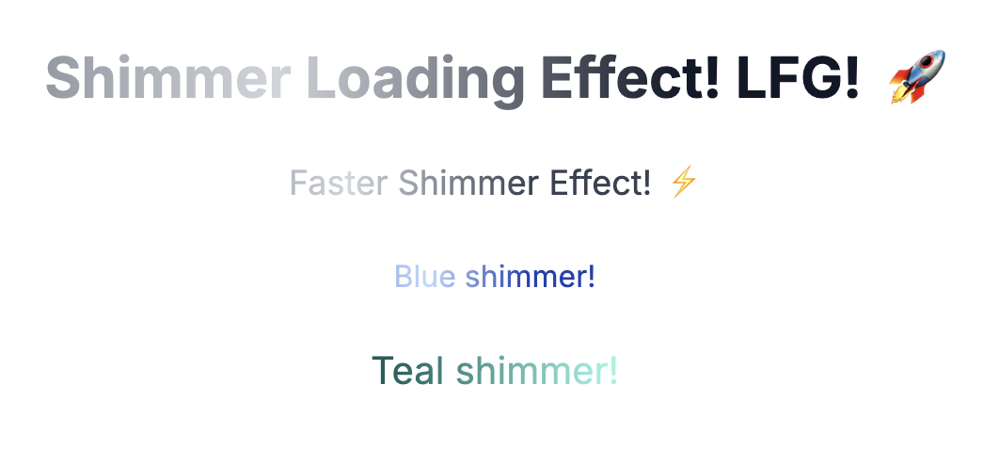

# shadcn-shimmer



A shimmer effect for React to use along with shadcn. I was dying to get this shimmering effect! I couldn't find it, so I reverse-engineered v0's "thinking" effect and published it as a shadcn component.

Live demo: https://www.carlosgalarza.com/shadcn-shimmer

## Installation

Add the shimmer component to your shadcn/ui project:

```bash
npx shadcn@latest add https://carlosgalarza.com/ui/shimmer.json
```

## Prerequisites

- A Next.js project with shadcn/ui configured
- The `cn` utility function (automatically installed with `npx shadcn@latest init`)
- Tailwind CSS

## Component Overview

The Shimmer component wraps children with a customizable shimmer loading effect using CSS animations and text clipping. It's perfect for creating loading states and drawing attention to specific text elements.

### Features

- **Configurable duration**: Control animation speed with `shimmerDuration` prop
- **Customizable colors**: Override shimmer colors using CSS custom properties
- **Polymorphic**: Use `asChild` prop to render as child element
- **Accessible**: Maintains semantic HTML structure
- **Zero dependencies**: Only requires `@radix-ui/react-slot` (automatically installed)

## Usage

### Basic Example

```tsx
import { Shimmer } from "@/components/shimmer"

export function LoadingText() {
  return (
    <Shimmer>
      <span>Loading content...</span>
    </Shimmer>
  )
}
```

### Advanced Examples

#### Custom Duration
```tsx
<Shimmer shimmerDuration={2}>
  <span>Slow shimmer effect</span>
</Shimmer>

<Shimmer shimmerDuration={0.3}>
  <span>Fast shimmer effect</span>
</Shimmer>
```

#### Custom Colors
```tsx
<Shimmer
  className="[--shimmer-base:theme(colors.blue.800)] [--shimmer-highlight:theme(colors.blue.200)]"
>
  <span>Blue shimmer theme</span>
</Shimmer>
```

#### As Child Component
```tsx
<Shimmer asChild shimmerDuration={1.5}>
  <h1 className="text-4xl font-bold">Shimmering Headline</h1>
</Shimmer>
```

#### Complex Layout
```tsx
<div className="space-y-4">
  <Shimmer
    shimmerDuration={0.8}
    className="[--shimmer-base:theme(colors.teal.800)] [--shimmer-highlight:theme(colors.teal.300)]"
  >
    <span className="text-xl">Thinking deeply...</span>
  </Shimmer>

  <Shimmer
    asChild
    className="[--shimmer-base:theme(colors.gray.700)] [--shimmer-highlight:theme(colors.gray.300)]"
  >
    <p>Processing your request...</p>
  </Shimmer>
</div>
```

## API Reference

### Props

| Prop | Type | Default | Description |
|------|------|---------|-------------|
| `children` | `React.ReactNode` | - | Content to apply shimmer effect to |
| `shimmerDuration` | `number` | `0.65` | Animation duration in seconds |
| `asChild` | `boolean` | `false` | Render as child element using Radix Slot |
| `className` | `string` | - | Additional CSS classes |

### CSS Custom Properties

Customize shimmer colors using CSS custom properties:

| Property | Default | Description |
|----------|---------|-------------|
| `--shimmer-base` | `theme(colors.gray.900)` | Base/background color |
| `--shimmer-highlight` | `theme(colors.gray.300)` | Highlight color that animates across |

## Styling

The component uses CSS `background-clip: text` to create the shimmer effect. The animation moves a linear gradient across the text, creating the shimmer appearance.

### Dark Mode Support

Colors automatically adapt to your theme. Override using Tailwind's color system:

```tsx
// Light mode friendly
<Shimmer className="[--shimmer-base:theme(colors.gray.200)] [--shimmer-highlight:theme(colors.gray.600)]">
  <span>Light theme shimmer</span>
</Shimmer>

// Dark mode friendly
<Shimmer className="[--shimmer-base:theme(colors.gray.800)] [--shimmer-highlight:theme(colors.gray.200)]">
  <span>Dark theme shimmer</span>
</Shimmer>
```

## Registry Information

- **Registry URL**: `https://carlosgalarza.com/ui/shimmer.json`
- **Component Type**: `registry:component`
- **Dependencies**: `@radix-ui/react-slot@^1.2.0`
- **Files**:
  - `registry/shimmer.tsx` - React component
  - `registry/shimmer.css` - CSS animations

## Development

This component is built with:
- **React 19** for the latest React features
- **TypeScript** for type safety
- **Tailwind CSS** for styling
- **Radix UI Slot** for polymorphic behavior

The registry follows shadcn/ui conventions and can be used alongside other shadcn/ui components seamlessly.

## License

MIT License - feel free to use in your projects!
